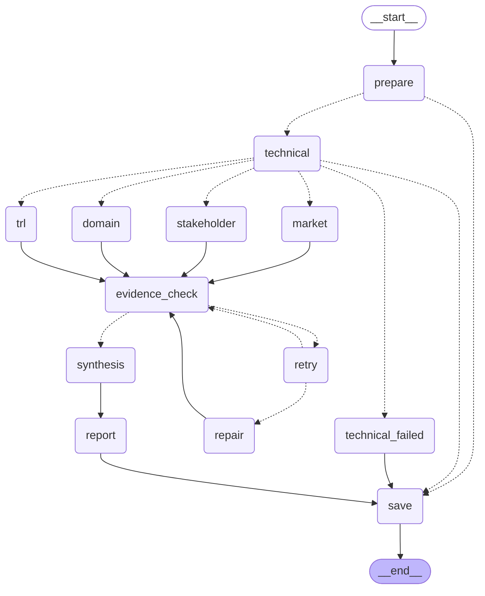

# Subject

본 프로젝트는 KV cache 최적화 기술을 소프트웨어(KIVI)와 하드웨어(InfiniGen) 두 진영에서 선정하여, 시장성·이해관계자·도메인 적용·기술 성숙도 관점에서 중립적으로 비교 평가하는 LangGraph 기반 Multi-Agent Agentic RAG를 개발하는 프로젝트임.

이 브랜치 `feat/graph-output`은 D 역할(LangGraph State/Node/Edge, 병렬 fan-out/join, 근거 검사·보완 루프, 평가 종합, 보고서 출력, CLI)을 구현한다. 논문 RAG(A, `feat/paper-rag`), 웹 근거(B, `feat/web-evidence`), 관점 평가 에이전트(C, `feat/evaluation`)는 합병 시 `PipelineServices`에 연결한다. 통합 계약은 [docs/GRAPH_OUTPUT_DESIGN.md](docs/GRAPH_OUTPUT_DESIGN.md)에 있다.

## Overview

- Objective : 하나의 기술을 복수 관점에서 비교 평가하고, 관점 간 상충 지점을 성립 조건과 함께 제시 (우열·추천 없음)
- Method : Multi-Agent(병렬 fan-out/join) + Agentic RAG + 근거 검사·보완 루프(최대 2회)
- Tools : LangGraph StateGraph/Send, Pydantic, FAISS(A), Tavily Search(B), Jinja2, reportlab

## Selected Technologies

- SW : KIVI — Key는 채널 단위, Value는 토큰 단위로 2비트 양자화. 학습 없이 기존 모델에 적용 가능, 공개 구현 존재, 후속 양자화 연구의 비교 기준 (ICML 2024)
- HW : InfiniGen — KV를 CPU 메모리로 내보내고 다음 층 계산에 중요한 KV만 프리패치. 새 하드웨어 없이 기존 CPU·GPU 서버에서 동작, OSDI 2024 발표와 공개 구현 존재

## Features

- 네 관점 에이전트의 병렬 실행과 명시적 합류(join), 관점별 독립 State 키와 ID 병합 reducer(충돌은 기록, 실행 중단 없음)
- 근거 검사 노드: 규칙 검사(항목·라벨·근거 실재·출처·주장 유형) + 검토 LLM(항목별 의미 검토, 캐시·호출 예산)
- 부족한 항목만 다시 조사하는 보완 루프: 실패한 관점만 `Send`로 병렬 재호출, 최대 2회
- 평가 종합: 검증된 판정만으로 일치·상충 쌍(관점 A/B 판정, 이유, 근거 ID, 조건, 불확실성) 구성. 총점·순위·추천 없음
- 보고서: SUMMARY(½쪽 이내) → 분석 배경 → 기술 선정 → 기술 개요 → 관점별 평가(표) → 시사점 → 한계점 → 근거 목록 → REFERENCE(실제 활용 자료만, 과제 표기 형식). Markdown/HTML/PDF(한글 글꼴 임베드)
- live 모드 LLM 출력 가드: 근거 ID·숫자·우열 표현 검증, 실패 시 규칙 기반 문장으로 대체하고 사유 기록
- 실행 기록 `run_manifest.json`: 도구 호출·토큰·실행 시간·보완 횟수·ID 충돌·오류·생성 방식
- 확증 편향 방지 전략 : 대칭 조사, 반례 질의, 주장 유형(reported_fact/inference/unverified) 표시, 미확인 라벨, 상충 쌍 형식의 종합 (설계 B.7)

## Tech Stack

- Framework : LangGraph 1.x
- LLM/Generator : gpt-5.4-mini (`RAG_MODEL_ID`로 변경)
- LLM/Judge : gpt-5.4-mini (생성과 다른 프롬프트, 별도 호출)
- Retrieval : FAISS - Hit Rate@5, MRR@5 (A 브랜치 합병 시 기재)
- Embedding : intfloat/multilingual-e5-small (A 브랜치)

## Agents

- 기술 조사 에이전트 (A, RAG): 두 논문에서 원리·실험 조건·성능 수치·한계 추출 → `technical_findings`, `evidence`
- 시장성 평가 에이전트 (B, 웹 검색): 시장 규모·채택 현황·생태계 → `market_analysis`
- 이해관계자 평가 에이전트 (B, 웹 검색): 경쟁 진영·도입 기업·투자 업계 발언 → `stakeholder_analysis`
- 도메인 평가 에이전트 (C, RAG): 클라우드 서빙 다섯 관심사에 대한 자료의 평가 → `domain_analysis`
- 기술 성숙도 평가 에이전트 (C, 웹 검색): TRL 단계별 증거 → `trl_analysis`
- 근거 검사 노드 + 검토 LLM (D): 규칙 검사와 의미 검토, 부족한 질문 생성 → `evidence_check`, `missing_questions`
- 평가 종합 에이전트 (D): 일치·상충 쌍과 조건·불확실성 → `synthesis`
- 보고서 생성 에이전트 (D): 한국어 보고서와 인용 → `report`, 산출물 5종

## Architecture



`python app.py --draw-graph docs/graph.mmd`로 다시 생성한다. 점선은 조건부 간선이며 `retry → repair`는 부족한 관점 수만큼 병렬 `Send`다.

## Directory Structure

```
├── app.py                        # 실행 스크립트 (live/replay, --fixture, --draw-graph)
├── src/skala_rag/
│   ├── config.py                 # 환경 변수 설정과 검증
│   ├── graph/
│   │   ├── schemas.py            # 공유 Pydantic 계약 (RunConfig, Source, Evidence, PerspectiveResult, ...)
│   │   ├── state.py              # GraphState, ID 병합 reducer, metrics 이벤트
│   │   ├── evidence_check.py     # 규칙 검사 + 검토 LLM 호출
│   │   ├── workflow.py           # PipelineServices, 그래프 구성, 보완 Send
│   │   └── demo.py               # 합성 fixture (흐름 검증 전용)
│   ├── agents/
│   │   ├── review.py             # 검토 LLM (근거 의미 검토, 캐시·예산)
│   │   ├── synthesis.py          # 규칙 기반 일치·상충 쌍
│   │   ├── llm_output.py         # live 종합·SUMMARY LLM 에이전트와 출력 가드
│   │   ├── report.py             # 보고서 장 구성, Markdown/HTML/PDF, manifest
│   │   └── report_static.py      # 분석 배경·기술 선정 정적 장
│   └── templates/report.html.j2  # HTML 템플릿
├── tests/                        # 47개 테스트
├── docs/                         # 설계·이력·검토 문서, graph.mmd
└── outputs/                      # 보고서·출처 목록·실행 기록 (git 제외)
```

A/B/C 합병 후에는 설계 E.2의 `data/`, `indexes/`, `tools/`, `prompts/`, `evaluation/`이 추가된다.

## Usage

```bash
uv sync --only-group graph --only-group dev   # 이 브랜치 최소 환경 (팀 전체 환경: uv sync --group dev)
source .venv/bin/activate
cp .env.template .env                          # OPENAI_API_KEY, TAVILY_API_KEY 입력 (app.py가 자동 로드)
python app.py --mode replay --fixture --output-dir outputs/demo   # 합성 자료로 그래프·보고서 흐름 검증
python -m pytest -q
```

팀 서비스 연결 후 실제 실행:

```bash
python app.py --mode replay --services integration.services:create_services --output-dir outputs/replay
python app.py --mode live --services integration.services:create_services --paper-dir data/papers \
  --output-dir outputs/live --report-name RAG-Output_판교_10반_이름1+이름2+이름3+이름4
```

주요 옵션: `--technologies SW HW`, `--domain`, `--as-of YYYY-MM-DD`, `--web-search-max 20 --fetch-max 30 --tool-timeout 20 --tool-retries 2`, `--max-paper-pages 200`, `--semantic-review auto|on|off`, `--max-review-calls 72`, `--deterministic-output`, `--report-name`, `--draw-graph [PATH]`.

`--fixture` 출력은 합성 자료이며 실제 KIVI/InfiniGen 평가 결과가 아니다. `live`는 검토 LLM과 종합·SUMMARY LLM을 켜고, `replay`는 규칙 기반으로 재현 가능한 출력을 만든다. 검증 환경: Python 3.14.6, macOS.

## Contributors

- (합병 시 개인별 수행 역할 기재. PM/PL 역할은 제외)
- A `feat/paper-rag` : PDF 처리, 청크 분할, 임베딩·FAISS 색인, 논문 검색 도구
- B `feat/web-evidence` : 시장성·이해관계자 에이전트, Tavily 검색·원문 조회 도구, replay 캐시
- C `feat/evaluation` : 도메인·기술 성숙도 에이전트, 관점 Rubric 프롬프트
- D `feat/graph-output` : LangGraph State/Node/Edge, 병렬 fan-out/join, 근거 검사·검토 LLM, 보완 루프, 평가 종합, 보고서·PDF, CLI
