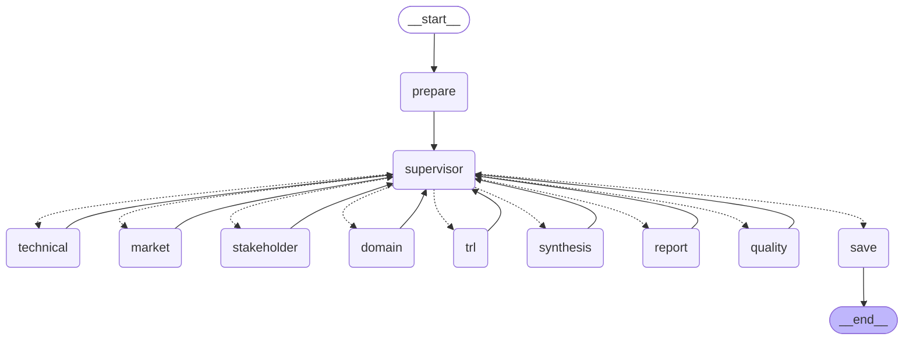

# Subject

KV cache 최적화 기술을 소프트웨어 진영(KIVI)과 하드웨어 진영(InfiniGen)에서 하나씩 골라, 기술 성숙도·시장성·이해관계자·도메인 적용의 네 관점에서 평가하는 Supervisor 패턴 멀티 에이전트 프로젝트입니다. 논문과 웹 자료를 근거로 클라우드 LLM 서빙 환경의 적용 조건과 한계를 정리하며, 두 기술의 우열을 가리지 않고 관점에 따라 평가가 어떻게 달라지는지를 조건과 함께 설명합니다.

## Overview

- Objective : 두 기술을 네 관점에서 평가하고, 관점 간 평가가 엇갈리는 지점을 성립 조건과 함께 제시 (우열·추천 없음)
- Method : Supervisor 패턴 + Agentic RAG + 근거 충분성 평가와 재작업 루프 + 보고서 품질 평가 루프
- Tools : LangGraph(StateGraph, Send, checkpointer), Pydantic, FAISS, Tavily Search, Jinja2, reportlab, LangSmith

### 패턴 선택: Supervisor

| | Supervisor (선택) | Orchestrator-Workers |
| --- | --- | --- |
| 흐름 | 매 단계 State를 보고 다음 에이전트를 고름 | 처음에 계획을 세우고 Worker에 한 번에 분배 |
| 맞는 경우 | 결과를 본 뒤에 무엇을 더 조사할지 정해야 할 때 | 하위 작업이 처음부터 독립적으로 나뉠 때 |
| 비용 | 결정 단계가 늘어 실행이 길어짐 | 한 번에 병렬 처리해 빠름 |

이 과제는 "근거가 충분한가"를 확인한 뒤에야 다음 행동이 정해집니다. 네 관점 중 어느 것이 부족한지, 다시 조사할지, 보고서를 고쳐 쓸지는 결과를 본 뒤에 결정되므로 Supervisor를 골랐습니다. 대신 결정 횟수가 늘어나는 비용은 재작업·품질 루프·전체 결정 횟수의 상한으로 묶었습니다.

## Selected Technologies

- SW : KIVI — Key는 채널 단위, Value는 토큰 단위로 2비트 양자화. 학습 없이 기존 모델에 적용 가능 (ICML 2024)
- HW : InfiniGen — KV를 CPU 메모리로 내보내고 다음 층 계산에 중요한 KV만 프리패치. 새 하드웨어 없이 기존 CPU·GPU 서버에서 동작 (OSDI 2024)

## Features

- Supervisor 허브: `prepare`와 `save`를 뺀 모든 노드가 Supervisor에서 나가고 Supervisor로 돌아옴. 하위 에이전트끼리의 간선 없음
- State 기반 분기: Supervisor가 관점별 상태와 근거 충분도를 보고 `add_conditional_edges`로 다음 노드를 선택. 순서와 스텝 수가 고정되지 않음
- 근거 충분성 평가: 규칙 검사(항목·라벨·근거 실재·출처·주장 유형)와 검토 LLM(근거 구절이 판정을 뒷받침하는지)
- 재작업: 근거가 부족한 관점에만, 부족한 (기술, 항목)과 사유를 담은 지시를 보내 다시 조사. 사유에 따라 검색어를 바꿈
- 보고서 품질 평가: Groundedness, 중립성, 편향 통제, 관점 커버리지를 규칙 검사와 LLM Judge로 1~5점 평가(Hybrid)
- 품질 루프: 미달이면 지적된 문장을 고쳐 쓰거나(재작성) 근거를 다시 모음(재수집). 상한에 닿으면 미달 항목을 한계점에 적고 종료
- 보고서: SUMMARY → 분석 배경 → 기술 선정 → 기술 개요 → 관점별 평가 → 시사점 → 한계점 → 부록(근거 목록) → REFERENCE. PDF 10쪽 이내로 자동 조정, 본문 인용은 `[1]` 번호
- LLM 출력 가드: 존재하는 근거 번호만 인용, 근거에 없는 숫자 금지, 우열·추천 표현 금지. 걸리면 규칙 기반 문장으로 대체
- 실행 기록 `run_manifest.json`: `run_id`, Supervisor의 결정과 사유, 관점별 상태와 재작업 횟수, 품질 점수, 도구 호출·토큰·시간
- 확증 편향 방지: 두 기술에 같은 질문, 장점 검색마다 한계 검색을 짝지음, 주장 유형 표시, 근거가 없으면 미확인으로 남김

## Tech Stack

- Framework : LangGraph 1.x
- LLM : `gpt-5.6-luna` (환경 변수 `RAG_MODEL_ID` 하나로 모든 호출에 적용)
- Judge : 같은 모델, 생성과 다른 프롬프트와 별도 호출 (근거 검토, 품질 평가)
- Retrieval : FAISS — Hit Rate@5 65%, MRR@5 0.403 (라벨링 질의 20개, `evaluation/retrieval/report.md`)
- Embedding : intfloat/multilingual-e5-small
- Web : Tavily Search / Extract

## Agents

| 에이전트 | 역할 | 쓰는 State |
| --- | --- | --- |
| Supervisor | 다음 노드 결정, 근거 충분성 평가, 재작업 지시, 품질 결과에 따른 분기, 종료 판단 | 제어 필드 전부, `evidence_check` |
| 기술 조사 | 두 논문에서 원리·실험 조건·성능·한계 추출 (RAG) | `technical_findings`, `evidence` |
| 시장성 | 시장 규모, 채택 현황, 생태계 (웹 검색) | `market_analysis` |
| 이해관계자 | 경쟁 진영, 도입 기업·개발자, 투자·미디어의 실제 발언 (웹 검색) | `stakeholder_analysis` |
| 도메인 적용 | 메모리·품질·지연·처리량·통합 부담에 대한 자료의 평가 (RAG) | `domain_analysis` |
| 기술 성숙도 | TRL 단계별 증거 (RAG + 웹 검색) | `trl_analysis` |
| 종합 | 관점 간 일치·상충 쌍과 성립 조건 | `synthesis` |
| 보고서 작성 | 보고서 조립, SUMMARY·기술 개요·시사점 작성, 품질 지적 반영 | `report` |
| 품질 평가 | 4개 항목 채점, 수정 지시 또는 재수집 요청 생성 | `quality_result` |

## Architecture


```mermaid
graph TD;
	__start__([__start__]):::first
	prepare(prepare)
	supervisor(supervisor)
	technical(technical)
	market(market)
	stakeholder(stakeholder)
	domain(domain)
	trl(trl)
	synthesis(synthesis)
	report(report)
	quality(quality)
	save(save)
	__end__([__end__]):::last
	__start__ --> prepare;
	prepare --> supervisor;
	supervisor -.-> technical;
	supervisor -.-> market;
	supervisor -.-> stakeholder;
	supervisor -.-> domain;
	supervisor -.-> trl;
	supervisor -.-> synthesis;
	supervisor -.-> report;
	supervisor -.-> quality;
	supervisor -.-> save;
	technical --> supervisor;
	market --> supervisor;
	stakeholder --> supervisor;
	domain --> supervisor;
	trl --> supervisor;
	synthesis --> supervisor;
	report --> supervisor;
	quality --> supervisor;
	save --> __end__;
	classDef default fill:#f2f0ff,line-height:1.2
	classDef first fill-opacity:0
	classDef last fill:#bfb6fc
```

점선은 조건부 간선입니다. `python app.py --draw-graph docs/graph.mmd`로 다시 만듭니다.

Supervisor는 매 턴 아래 순서로 판단합니다.

1. 치명 오류가 있으면 저장하고 종료
2. 결정 횟수가 상한이면 있는 자료로 마무리
3. 기술 조사 결과가 없으면 기술 조사 실행
4. 아직 실행하지 않은 관점이 있으면 그 관점들을 실행 (`Send`, 동시 실행)
5. 관점이 돌아왔으면 근거 충분성 평가. 부족하고 재작업 횟수가 남은 관점만 재작업 지시와 함께 다시 실행
6. 충분하거나 재작업 상한에 닿았으면 종합 → 보고서 → 품질 평가
7. 품질 결과에 따라 저장, 보고서 재작성, 관점 재수집 중 하나. 재수집할 수 없으면 지적된 문장을 고쳐 쓰는 재작성으로 내려감

## State Schema

제어 필드와 페이로드를 나눴습니다. 제어 필드는 Supervisor만 쓰고(`quality_result`만 품질 평가 노드), 하위 에이전트는 페이로드와 `errors`, `metrics`만 반환합니다.

| 구분 | 필드 |
| --- | --- |
| 제어 | `run_id`, `next`, `step_count`, `agent_status`, `rework_requests`, `decision_log`, `quality_result`, `quality_attempts` |
| 페이로드 | `run_config`, `sources`, `evidence`, `errors`, `metrics`, `technical_findings`, `*_analysis`, `evidence_check`, `synthesis`, `report`, `artifacts` |

| 항목 | 설계 |
| --- | --- |
| 제어 vs 페이로드 분리 | 라우팅에 필요한 것은 관점별 상태·시도 횟수(`agent_status`), 다음 노드(`next`), 재작업 지시(`rework_requests`)뿐. 작업 결과와 섞지 않음 |
| 관측성 위치 | 결정과 사유를 `decision_log`에 한국어 한 문장으로 기록하고 실행 기록 파일에 저장. 상세 호출은 LangSmith 트레이스 |
| 지속성 비용 | `decision_log`는 최근 30개만 유지, 근거 인용 구절은 1,200자로 제한, 하위 에이전트에는 State 전체가 아니라 네 키(`run_config`, 자기 관점의 이전 결과, `rework_requests`, `known_evidence_ids`)만 전달 |
| 상관 | `run_id` 하나가 State, `run_manifest.json`, LangSmith 메타데이터, 체크포인터의 `thread_id`에 공통으로 들어감 |
| 재개/복구 | 체크포인터가 Supervisor 결정마다 State를 저장. 관점별 `status`(`pending`/`running`/`done`/`insufficient`/`failed`), `attempts`, `last_error`와 `errors`가 State에 있음. 현재 체크포인터는 메모리 방식이라 프로세스 안에서만 유효 |
| 동시 처리 | 동시에 실행되는 관점 에이전트가 함께 쓰는 `sources`·`evidence`·`errors`는 ID 병합 reducer(먼저 온 값 유지, 다른 값은 충돌로 기록), `metrics`는 이벤트 추가 reducer. 관점 결과는 관점마다 키가 달라 충돌 없음 |
| 종료 보장 | 관점별 재작업 2회, 품질 루프 2회, Supervisor 결정 20회(최악 경로 19회), 그래프 `recursion_limit` 50 |

## Quality Evaluation

보고서 생성 뒤 품질 평가 노드가 네 항목을 1~5점으로 평가합니다(Hybrid). 항목 점수는 규칙 점수와 LLM Judge 점수 중 낮은 쪽입니다.

| 항목 | 규칙 검사 | LLM Judge | 통과 | 미달 시 |
| --- | --- | --- | --- | --- |
| Groundedness | 근거가 달린 서술 문장의 비율, 존재하지 않는 근거 인용, 본문 인용 → 부록 근거 → REFERENCE 출처의 연결 | 인용한 구절이 문장을 뒷받침하는지 (SUMMARY, 기술 개요, 시사점) | 4점 | 보고서 재작성 |
| 중립성 | 추천·순위·우열 표현 (부정문 안의 표현은 제외) | 정규식에 걸리지 않는 암묵적 우열 판정 | 4점 | 보고서 재작성 |
| 편향 통제 | 판정별 서로 다른 출처 수, 한 출처의 인용 비중, 기술 간 근거 수와 긍정·신중 판정의 균형 | — | 3점 | 근거 재수집 |
| 관점 커버리지 | 네 관점 × 두 기술의 24개 항목 중 근거가 확인된 판정의 비율, 근거가 하나도 없는 (관점, 기술) 조합 | — | 4점 | 근거 재수집 |

- 편향 통제의 통과 기준이 3점인 이유: 공개 자료가 적은 기술은 판정 하나에 출처가 하나뿐인 경우가 많아, 출처 하나를 3점으로 두고 둘 이상을 가점으로 봅니다.
- 미달이면 평가 노드가 어느 절의 어느 문장이 무엇 때문에 문제인지와 고칠 방향을 지시로 남깁니다. 보고서 작성기는 지적된 절만 고칩니다.
- LLM을 쓰지 않는 실행(`--fixture`, replay 기본값)은 규칙 검사만 하므로 결과가 재현됩니다.

## Directory Structure

```
├── app.py                        # 실행 스크립트 (live/replay, --fixture, --draw-graph)
├── scripts/                      # 색인 생성, 검색 평가, 기술 조사 단독 실행
├── data/papers/                  # 논문 PDF와 manifest
├── data/web/                     # 웹 검색·원문 캐시 (replay용, git 제외)
├── indexes/                      # FAISS 색인
├── evaluation/retrieval/         # 검색 지표 측정 결과
├── src/skala_rag/
│   ├── config.py                 # 환경 변수, 기본 모델, 웹 예산 기본값
│   ├── graph/
│   │   ├── workflow.py           # Supervisor 노드와 그래프 구성
│   │   ├── state.py              # GraphState(제어/페이로드), reducer
│   │   ├── schemas.py            # 경계 계약(Pydantic), 상한 상수
│   │   ├── evidence_check.py     # 근거 충분성 규칙 검사
│   │   └── demo.py               # 합성 fixture 서비스
│   ├── integration/
│   │   ├── services.py           # 에이전트를 그래프 서비스 계약에 연결
│   │   └── rework.py             # 재작업 지시에 따른 검색어 생성
│   ├── agents/
│   │   ├── technical/            # 기술 조사
│   │   ├── market.py, stakeholder.py   # 시장성, 이해관계자
│   │   ├── domain.py, trl.py     # 도메인 적용, 기술 성숙도
│   │   ├── review.py             # 검토 LLM (근거가 판정을 뒷받침하는지)
│   │   ├── synthesis.py          # 관점 간 일치·상충 쌍
│   │   ├── report.py, report_static.py, llm_output.py   # 보고서 조립, LLM 작성과 가드, PDF/HTML
│   │   └── quality.py            # 보고서 품질 평가
│   ├── tools/
│   │   ├── retrieve/             # PDF 파싱, 청크, 임베딩, FAISS 검색
│   │   ├── web.py                # Tavily 검색, 원문 조회, 요약, 캐시
│   │   └── budget.py             # 실행당 웹 검색·조회 예산
│   ├── prompts/, schemas/        # 도메인·TRL Rubric 프롬프트와 판정 스키마
│   ├── templates/report.html.j2  # HTML 템플릿
│   └── assets/fonts/             # 보고서 글꼴 Pretendard (SIL OFL 1.1)
├── tests/                        # pytest 204개 (네트워크·실제 LLM 호출 없음)
├── docs/
│   ├── graph.mmd                 # 그래프 도식
│   └── agent/history/            # 작업 이력 (무엇을, 왜 바꿨는지)
└── outputs/                      # 보고서와 실행 기록 (git 제외)
```

## Usage

```bash
uv sync --group dev
cp .env.template .env        # OPENAI_API_KEY, TAVILY_API_KEY, (트레이스용) LANGSMITH_API_KEY 입력
```

합성 자료로 흐름만 확인 (키 필요 없음):

```bash
uv run python app.py --mode replay --fixture --output-dir outputs/demo
uv run python -m pytest -q
```

실제 실행:

```bash
uv run python app.py --mode live --output-dir outputs/live --report-name Agent-Output
```

- `live`는 OpenAI와 Tavily 키가 필요합니다. 재작업과 품질 루프를 모두 돌면 15분 안팎이 걸립니다.
- `replay`는 `data/web/` 캐시를 재생합니다(웹 호출 없음, 판정 LLM은 호출). 캐시는 live를 한 번 실행하면 만들어집니다.
- 모델은 `.env`의 `RAG_MODEL_ID`로 바꿉니다. 코드의 기본값은 `src/skala_rag/config.py` 한 곳에 있습니다.
- LangSmith 트레이스는 `.env`에 `LANGSMITH_TRACING=true`, `LANGSMITH_API_KEY`, `LANGSMITH_PROJECT`를 넣으면 기록됩니다. 실행 시작 때 출력되는 `run_id`가 트레이스 메타데이터와 `run_manifest.json`에 같이 들어갑니다.

주요 옵션: `--web-search-max 100 --fetch-max 150`(실행당 웹 예산), `--semantic-review auto|on|off`, `--llm-output auto|on|off`, `--model-id`, `--as-of YYYY-MM-DD`, `--report-name`, `--draw-graph [PATH]`.

산출물은 `--output-dir`에 생깁니다: 보고서(`.pdf`, `.html`, `.md`), `sources.json`, `run_manifest.json`. `--fixture` 출력은 합성 자료이며 실제 평가 결과가 아닙니다.

## Contributors

- 김산 : Supervisor 그래프 설계와 구현 — State 스키마(제어/페이로드 분리), 근거 충분성 평가에 따른 분기, 재작업·품질 루프와 종료 상한, 체크포인터와 `run_id`·LangSmith 메타데이터
- 이승석 : 하위 에이전트 재작업 — 재작업 지시에 따른 항목 단위 재수집, 사유별 검색어 재생성, 실행당 웹 예산, 수집 실패 격리
- 김건우 : 보고서 품질 평가 노드 — 네 항목의 규칙 검사와 LLM Judge, 수정 지시·재수집 요청 생성, 인용에서 출처까지의 연결 검증
- 서경덕 : 보고서 작성과 통합 — 인용 번호화와 10쪽 분량 조정, 보고서 조판, 품질 지적을 반영한 재작성, 실행 기록, 실제 자료 실행 검증과 모델·의존성 정리
